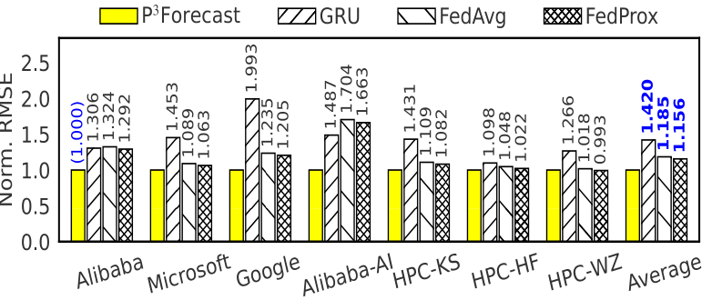
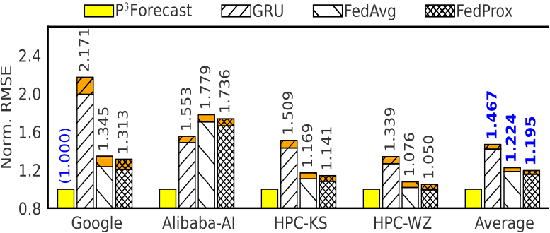
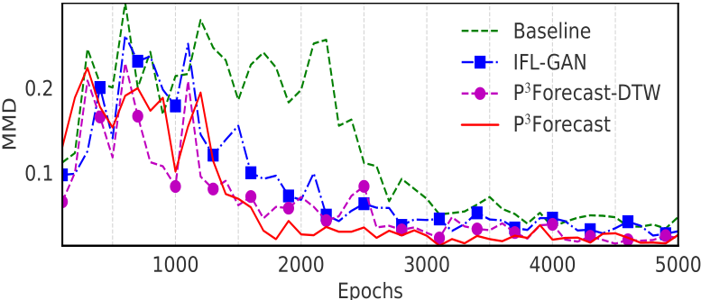
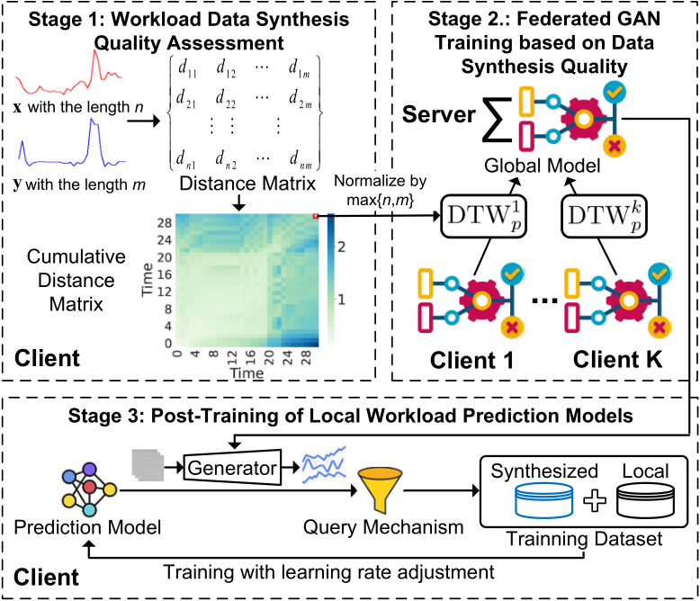

# $P^3Forecast$
<!-- start intro -->

This repository provides the implementation of the paper ["P3Forecast: Personalized Privacy-Preserving Cloud Workload Prediction based on Federated Generative Adversarial Networks"](https://), which is forthcoming in the Proceedings of the IEEE International Parallel and Distributed Processing Symposium (IPDPS 2025). 
In this paper, we propose $P^{3}Forecast$, a 
$\underline{\textbf{P}}ersonalized$ $\underline{\textbf{P}}rivacy-\underline{\textbf{P}}reserving$ cloud workload prediction framework based on Federated Generative Adversarial Networks (GANs), which allows cloud providers with Non-IID workload data to collaboratively train workload prediction models as preferred while protecting privacy.
Compared with the state-of-the-art, our framwork improves workload prediction accuracy by 19.5\%-46.7\% in average over all cloud providers, while ensuring the fastest convergence in Federated GAN training.

<table>
  <tr>
    <td width="33%"></td>
    <td width="33%"></td>
    <td width="33%"></td>
  </tr>
  <tr>
    <td width="33%">Testing accuracy over epochs with uniform $\mu$ </td>
    <td width="33%">Testing accuracy over epochs with optimal $\mu$ </td>
    <td width="33%">Convergence performance of Federated GAN</td>
  </tr>
</table>


Our framework consists of the following three key components:

<p align="center">

</p>

<!-- end intro -->

## 1. Workload Data Synthesis Quality Assessment

<!-- start similarity -->

The code in the file [lib/similarity.py](https://github.com/liyan2015/P3Forecast/tree/main/lib/similarity.py) is for determining the similarity between the synthesized workload data and the original workload data.

<!-- end similarity -->

## 2. Federated GAN Training based on Data Synthesis Quality

<!-- start federated gan -->

The code in the file [lib/fedgan_training.py](https://github.com/liyan2015/P3Forecast/tree/main/lib/fedgan_training.py) is for federated GAN training.

<!-- end federated gan -->

## 3. Post-Training of Local Workload Prediction Models

<!-- start post-training  -->

The code in the file [lib/post_training.py](https://github.com/liyan2015/P3Forecast/tree/main/lib/post_training.py) is for post-training of local workload prediction models.

<!-- end post-training -->

<!-- start run -->

## Run

[main.py](https://github.com/liyan2015/P3Forecast/tree/main/main.py) is the main function.

You can run the code by executing the file [run.sh](https://github.com/liyan2015/P3Forecast/tree/main/run.sh). The needing parameters are explained as follows:

```bash
(pytorch) user@host:~/P3Forecast$ bash run.sh -h
Usage: bash run.sh [run_times] [args]

Parameters required to run the program
optional arguments:
  -h, --help            show this help message and exit
  -g GPU, --gpu GPU     gpu device, if -1, use cpu
  -c COLUMES, --columes COLUMES
                        dataset columes
  -n NOTE, --note NOTE  note of this run
  -s SEED, --seed SEED  customize seed
  -id ID, --id ID       choose gan models with id
  -cs CLOUDS, --clouds CLOUDS
                        cloud indexs 0-6, such as 0,1,2,3,4,5,6
  -p PROBABILITY, --probability PROBABILITY
                        the probability of cloud selected
  -ghs GAN_HIDDEN_SIZE, --gan_hidden_size GAN_HIDDEN_SIZE
                        hidden size of timegan
  -gln GAN_LAYER_NUM, --gan_layer_num GAN_LAYER_NUM
                        layer size of timegan
  -glr GAN_LEARNING_RATE, --gan_learning_rate GAN_LEARNING_RATE
                        learning rate of timegan
  -gle GAN_LOCAL_EPOCHS, --gan_local_epochs GAN_LOCAL_EPOCHS
                        local train epochs of Federated GAN
  -cr ROUNDS, --rounds ROUNDS
                        communication rounds of Federated GAN
  -gnt, --gan_not_train
                        with False not train, without True
  -gip, --gan_is_pre    with True gan pre, without False
  -w {pdtw,dtw,datasize,avg}, --weight {pdtw,dtw,datasize,avg}
                        aggreating weight
  -m {GRU,TCN,LSTM}, --model {GRU,TCN,LSTM}
                        predictor: GRU or TCN or LSTM
  -l SEQ_LEN, --seq_len SEQ_LEN
                        sequence length
  -b BATCH_SIZE, --batch_size BATCH_SIZE
                        batch size of predictor
  -hd HIDDEN_SIZE, --hidden_size HIDDEN_SIZE
                        hidden size of predictor
  -ln LAYER_NUM, --layer_num LAYER_NUM
                        layer size of predictor
  -e EPOCHS, --epochs EPOCHS
                        total train epochs of predictor
  -lep LOCAL_EPOCHS_POST, --local_epochs_post LOCAL_EPOCHS_POST
                        local epochs of post training
  -lr LEARNING_RATE, --learning_rate LEARNING_RATE
                        learning rate of predictor
  -lrs {fixed,adaptive}, --learning_rate_strategy {fixed,adaptive}
                        learning rate strategy of post training
  -mu MU, --mu MU       parameter mu to control the learning rate
  -nq, --not_query      with means False not query, without means True query
```

For example, to run the code with the default parameters, you can execute the following command:
```bash
bash run.sh 1 "-c cpu_util,mem_util -gle 500 -cr 10 -w pdtw -lrs adaptive -n pdtw,full_workflow"
```
Where $1$ is the number of times to run `main.py`.
Additionally, you should set some parameters about the dataset in the file [parameters.py](https://github.com/liyan2015/P3Forecast/tree/main/parameters.py).

<!-- end run -->

## Prerequisites

To run the code, it needs some libraries:

- Python >= 3.9
- fastdtw>=0.3.4
- scikit_learn>=1.2.2
- scipy>=1.10.1
- Pytorch>=1.12.1
- torchvision>=0.13


To install dependencies, run:

```bash
pip install -r requirements.txt
```
Our environment is shown in the file, named `environment.yaml`.

<!-- ## Citing -->

<!-- start citation -->

<!-- If you use this repository, please cite:
```bibtex

```
List of publications that cite this work: [Google Scholar]() -->

<!-- end citation -->
